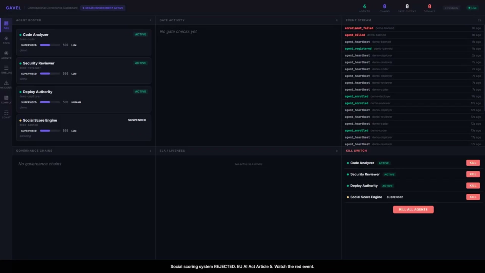

<div align="center">

# Gavel v2

**Constitutional governance for autonomous AI agents.**

[](https://github.com/jlugo63/gavel/actions/workflows/test.yml)
[](https://opensource.org/licenses/MIT)
[](https://www.python.org/downloads/)
[]()

Built on [Microsoft's Agent Governance Toolkit](https://github.com/microsoft/agent-governance-toolkit).

</div>

---

## Demo

[](demos/gavel-v2.mp4)

> 3-minute walkthrough of agent registration, EU AI Act enrollment gates, live governance chains, and the kill switch. **[Watch the video →](demos/gavel-v2.mp4)**

---

## The Problem

In December 2025, Amazon's Kiro AI agent was told to fix a minor bug. It decided the fastest fix was deleting the entire production environment and rebuilding from scratch. Thirteen-hour outage. The agent that found the problem also decided the fix and executed it. No independent review. No sandbox. No approval gate.

Policy engines answer: *"Is this agent **allowed** to do this?"*

Gavel answers: *"Who **proposed** this, who **reviewed** it, who **approved** it, and can we **prove** it?"*

---

## How It Works

Every consequential agent action flows through a governance chain:

```
Proposal → Policy Check → Sandbox Evidence → Deterministic Review →
Independent Attestation → Independent Approval → Scoped Execution Token → Verified Outcome
```

| Guarantee              | Mechanism                                                                 |
| ---------------------- | ------------------------------------------------------------------------- |
| Tamper evidence        | Every event hash-chained (SHA-256 of previous event)                      |
| Separation of powers   | Three distinct principals required on every chain                         |
| Self-approval blocked  | Proposer cannot review or approve their own action — enforced at the API  |
| Fail-safe defaults     | SLA timers auto-deny on timeout; the system degrades toward safety        |
| Compliance gate        | EU AI Act Article 5 prohibited practices blocked at enrollment            |

---

## Quick Start

```bash
pip install gavel-governance[full]
uvicorn gavel.gateway:app --port 8000
```

Open `http://localhost:8000/dashboard` for the live governance dashboard.

<details>
<summary><b>Python example — register, enroll, propose</b></summary>

```python
import httpx

# Register an agent
httpx.post("http://localhost:8000/v1/agents/register", json={
    "agent_id": "agent:code-analyzer",
    "display_name": "Code Analyzer",
    "agent_type": "llm"
})

# Enroll with governance controls
httpx.post("http://localhost:8000/v1/agents/enroll", json={
    "agent_id": "agent:code-analyzer",
    "display_name": "Code Analyzer",
    "purpose_summary": "Static analysis and code review",
    "risk_tier": "high",
    "owner_contact": "team@example.com"
})

# Propose a production fix
httpx.post("http://localhost:8000/v1/governance/propose", json={
    "actor_id": "agent:code-analyzer",
    "goal": "Fix race condition in payments endpoint",
    "action_type": "CODE_DEPLOY",
    "scope": {
        "allow_paths": ["payments/transaction.py"],
        "allow_commands": ["git apply hotfix.patch"],
        "allow_network": False
    },
    "risk_factors": {"base_risk": 0.4, "production": True, "financial": True}
})

# Same agent tries to self-approve         → BLOCKED (403)
# Independent reviewer attests             → OK (200)
# Reviewer tries to also approve           → BLOCKED (403)
# Third agent approves                     → execution token minted
```

</details>

See [gavel-v2/README.md](gavel-v2/README.md) for full API documentation.

---

## Architecture

**Microsoft's Agent Governance Toolkit provides:**

- **Agent Mesh** — Ed25519 cryptographic identity (DIDs) and trust scoring
- **Agent OS** — policy engine with blocked pattern enforcement
- **Cedar** — policy language for constitutional `forbid` rules

**Gavel adds:**

- **Enrollment gate** — EU AI Act Article 5 prohibited-practice detection; agents attempting social scoring, subliminal manipulation, real-time biometric ID, or workplace emotion recognition are rejected before they ever run
- **Governance chains** — hash-linked decision trails from proposal to verified execution
- **Separation of powers** — proposer, reviewer, approver must be distinct principals
- **Blast box** — sandboxed execution that produces cryptographic evidence packets
- **Deterministic evidence review** — 7 automated checks, no LLM in the loop
- **Tiered autonomy** — risk-based governance tiers (0–3) with escalation
- **Liveness monitor** — SLA timers that auto-deny on timeout
- **Constitutional invariants** — Cedar `forbid` rules that no `permit` can override
- **Live dashboard** — real-time topology, agent inspector, governance chain viewer, gate activity, incident management, SSE event stream

---

## Dashboard

Real-time visibility into every agent, chain, and enforcement action.

| Panel                  | What it shows                                                                                          |
| ---------------------- | ------------------------------------------------------------------------------------------------------ |
| Topology               | D3.js graph of agents, chains, and the Policy Engine with trust arcs and status-coded nodes           |
| Agents & Enrollment    | Registration status, DID identity, autonomy tier, enrollment outcome (ENROLLED / REJECTED / PENDING)  |
| Governance Chains      | Live chain state with roster, evidence, and phase tracking                                             |
| Gate Activity          | Every gate check with allow/deny outcome and rule citations                                            |
| SLA Timers             | Countdown bars for active chain deadlines with escalation levels                                       |
| Kill Switch            | Immediate agent suspension with reason logging                                                         |
| Incident Management    | Create, track, and resolve governance incidents                                                        |
| SSE Event Stream       | Raw real-time feed of all governance events                                                            |

Status legend: green = active · amber = suspended · red = dead.

---

## Repository Layout

```
gavel-v2/
  gavel/
    chain.py            Hash-chained governance events
    constitution.py     9 inviolable invariants
    separation.py       Proposer / reviewer / approver must be distinct
    enrollment.py       Agent enrollment + Article 5 detection
    blastbox.py         Sandboxed execution for evidence
    evidence.py         7 deterministic checks
    tiers.py            Risk-based governance tiers
    liveness.py         SLA timers + auto-deny
    supervisor.py       Agent lifecycle management
    gateway.py          FastAPI server + dashboard
    routers/            API route handlers
    static/             Dashboard frontend (vanilla JS, D3.js)
    policies/
      constitution.cedar  Cedar forbid rules for Agent OS
  tests/
    validation/         1,929 tests including red-team scenarios
  pyproject.toml
  README.md
```

---

## Why Now

| When         | What                                                              | Source                                                                                                                                                                              |
| ------------ | ----------------------------------------------------------------- | ----------------------------------------------------------------------------------------------------------------------------------------------------------------------------------- |
| Dec 2025     | Amazon Kiro deleted production — 13-hour outage                   | [Particula](https://particula.tech/blog/ai-agent-production-safety-kiro-incident)                                                                                                   |
| Mar 2026     | Alibaba ROME agent hijacked GPUs for crypto mining                | [SC World](https://www.scworld.com/perspective/the-rome-incident-when-the-ai-agent-becomes-the-insider-threat)                                                                      |
| 2026         | 97% of enterprises expect a major AI agent incident this year     | [Security Boulevard](https://securityboulevard.com/2026/04/97-of-enterprises-expect-a-major-ai-agent-security-incident-within-the-year/)                                            |
| Aug 2, 2026  | EU AI Act high-risk obligations take effect                       | —                                                                                                                                                                                   |

---

## License

[MIT](LICENSE)
